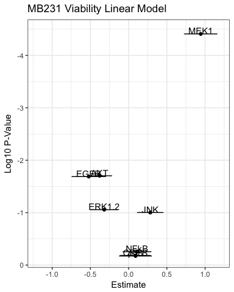
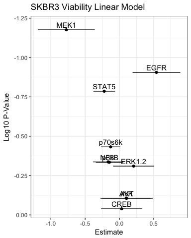

# A Pass at Figures
Aaron Meyer  
June 28, 2016  


**Note that text describes the figure following it.**

## Sample information

### Matrix
- TCPS:	tissue culture plastic
- gel:	stiff 2D PEG-PC gel
- single:	single cells in 3D PEG gel
- sph: spheroids in 3D PEG gel
- serum: spheroids in 3D PEG gel plus serum

### Drugs
- DMSO	
- lap:	lapatinib
- tems:	temsirolimus
- soraf:	sorafenib

2 biological replicates, each with 2 technical replicates	
DMSO control can be used for all 3 drugs (equalized DMSO concentration across all)	

This plots the drug response in each matrix condition separately, against pMek. From this it's possible to see a relationship between viability and pMek that exists across matrix conditions.


```r
mekPlot <- ggplot(MB231, aes(x = MEK1, y = prolifTwo, color = drug, shape = matrix)) + 
  geom_point() + facet_wrap( ~ matrix) + 
  coord_trans(x = "sqrt", y = "sqrt") + theme_bw() + ylab("Viability (RU)") + xlab("pMek")
# Hid this output as it's not used in the manuscript.
# plot(mekPlot)
```

A linear regression model clearly shows that pMek significantly explains some of the variance in viability. Note that the model explains about 30% of the variance, so there certainly are changes in drug response not completely captured by the model still.


```r
# Scaling the phospho-measurements by z-score
MB231d <- dplyr::select(MB231, prolifTwo, CREB, EGFR, NFkB, p38, AKT, JNK, MEK1, ERK1.2) %>%
  scale(center = TRUE, scale = TRUE) %>% data.frame

# Applying the linear model
model <- lm(prolifTwo ~ . + 0, data = MB231d)

# Summarize the model
model.sum <- (summary(model))

# Print the model summary
print(model.sum)
```

```
## 
## Call:
## lm(formula = prolifTwo ~ . + 0, data = MB231d)
## 
## Residuals:
##     Min      1Q  Median      3Q     Max 
## -1.5457 -0.4924 -0.1094  0.4007  3.1405 
## 
## Coefficients:
##        Estimate Std. Error t value Pr(>|t|)    
## CREB    0.08839    0.19838   0.446   0.6573    
## EGFR   -0.52229    0.22045  -2.369   0.0205 *  
## NFkB    0.10901    0.18457   0.591   0.5566    
## p38     0.08970    0.21109   0.425   0.6722    
## AKT    -0.38011    0.15950  -2.383   0.0198 *  
## JNK     0.28277    0.16948   1.669   0.0996 .  
## MEK1    0.94257    0.21496   4.385 3.89e-05 ***
## ERK1.2 -0.31953    0.18466  -1.730   0.0878 .  
## ---
## Signif. codes:  0 '***' 0.001 '**' 0.01 '*' 0.05 '.' 0.1 ' ' 1
## 
## Residual standard error: 0.8413 on 72 degrees of freedom
## Multiple R-squared:  0.3549,	Adjusted R-squared:  0.2832 
## F-statistic: 4.952 on 8 and 72 DF,  p-value: 6.646e-05
```

Plot of MB231 model parameters.


```r
# Extract the model coefficients for plotting
plotD <- data.frame(model.sum$coefficients)

ggplot(data = plotD, aes(x = Estimate, y = log10(Pr...t..), label = rownames(plotD))) + 
  geom_point() + theme_bw() + geom_text(nudge_y = 0.06) + scale_y_reverse() + xlim(-1.2, 1.2) +
  ylab("Log10 P-Value") + ggtitle("MB231 Viability Linear Model") + 
  geom_errorbarh(aes(xmin = Estimate - Std..Error, xmax = Estimate + Std..Error))
```

<!-- -->


# SKBR3

I've plotted the SKBR3 data with respect to pMek just for consistency with the MB231 data. There are considerable matrix-dependent differences in drug response, but they aren't really explained by pMek.


```r
MekSKBR <- ggplot(SKBR3, aes(x = MEK1, y = prolifTwo, color = drug, shape = matrix)) + geom_point() + facet_wrap( ~ matrix) + 
  coord_trans(x = "identity", y = "identity") + theme_bw() + ylab("Viability (RU)") + xlab("pMek")
# Hid this output as it's not used in the manuscript
# plot(MekSKBR)
```

A linear model with the SKBR3 measurements doesn't really pick up much.


```r
# Scaling the phospho-measurements by z-score
SKBR3d <- dplyr::select(SKBR3, prolifTwo, CREB, EGFR, NFkB, p38, AKT, JNK, MEK1, ERK1.2, STAT5, p70s6k) %>%
  scale(center = TRUE, scale = TRUE) %>% data.frame

# Applying the linear model
model <- lm(prolifTwo ~ . + 0, data = SKBR3d)

# Summarize the model
model.sum <- (summary(model))

# Print the model summary
print(model.sum)
```

```
## 
## Call:
## lm(formula = prolifTwo ~ . + 0, data = SKBR3d)
## 
## Residuals:
##      Min       1Q   Median       3Q      Max 
## -1.58014 -0.59450  0.04673  0.65844  2.31188 
## 
## Coefficients:
##        Estimate Std. Error t value Pr(>|t|)  
## CREB    0.03236    0.29938   0.108   0.9142  
## EGFR    0.54024    0.34725   1.556   0.1243  
## NFkB   -0.14597    0.19756  -0.739   0.4625  
## p38    -0.16422    0.22120  -0.742   0.4603  
## AKT     0.10487    0.38100   0.275   0.7839  
## JNK     0.09835    0.35510   0.277   0.7826  
## MEK1   -0.77432    0.41560  -1.863   0.0666 .
## ERK1.2  0.20660    0.29737   0.695   0.4895  
## STAT5  -0.22199    0.15770  -1.408   0.1636  
## p70s6k -0.12830    0.14208  -0.903   0.3696  
## ---
## Signif. codes:  0 '***' 0.001 '**' 0.01 '*' 0.05 '.' 0.1 ' ' 1
## 
## Residual standard error: 0.9656 on 70 degrees of freedom
## Multiple R-squared:  0.1739,	Adjusted R-squared:  0.05588 
## F-statistic: 1.473 on 10 and 70 DF,  p-value: 0.1679
```

Plot of SKBR3 model parameters.


```r
# Extract the model coefficients for plotting
plotD <- data.frame(model.sum$coefficients)

ggplot(data = plotD, aes(x = Estimate, y = log10(Pr...t..), label = rownames(plotD))) + 
  geom_point() + theme_bw() + geom_text(nudge_y = 0.03) + scale_y_reverse() +
  ylab("Log10 P-Value") + ggtitle("SKBR3 Viability Linear Model") + 
  geom_errorbarh(aes(xmin = Estimate - Std..Error, xmax = Estimate + Std..Error))
```

<!-- -->
